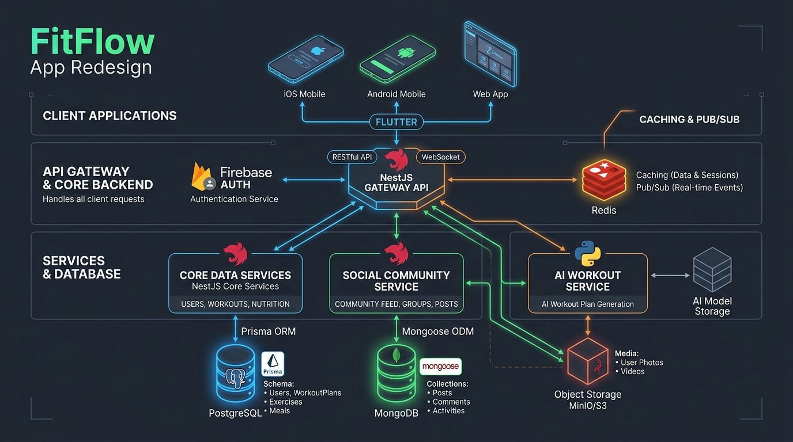

# FitFlow — Intelligent Fitness Redesign (IT3060 Coursework)

[](https://github.com/sandundimantha/fitflow-redesign/actions/workflows/ci.yml)
[](https://flutter.dev)
[](https://nestjs.com)
[](https://fastapi.tiangolo.com)
[](https://www.postgresql.org)
[](https://www.mongodb.com)
[](https://redis.io)

> **FitFlow** is an end-to-end fitness application redesign created for IT3060 (Human-Computer Interaction) coursework. It directly resolves prior usability testing bottlenecks by implementing a **strict 2-tap navigation rule**, an **above-the-fold today's scheduled workout card**, **one-line AI exercise rationales**, and **real-time social feed synchronization**.

---

## 🏛 System Architecture



### Architectural Stack Breakdown

| Layer | Technology | Responsibilities |
| :--- | :--- | :--- |
| **Client** | **Flutter** (iOS, Android, Web) | Native 60–120 FPS UI, sub-2s cold launch, Riverpod state management, offline-friendly caching. |
| **Core API Gateway** | **NestJS** (TypeScript / Node.js) | REST endpoints, WebSocket `/ws/feed` gateway, Firebase Auth verification with dev bypass, Prisma ORM, Redis client. |
| **AI Microservice** | **Python + FastAPI** | Asynchronous heuristic engine generating customized workout plans with 1-line rationales (< 3s SLA). |
| **Primary Relational DB** | **PostgreSQL 16** via **Prisma** | ACID-compliant user accounts, workouts, workout logs, nutrition logs, and saved AI plans. |
| **Secondary Document DB** | **MongoDB 7.0** via **Mongoose** | High-throughput social feed, comments, challenge posts, and user reactions. |
| **In-Memory Cache & Pub/Sub** | **Redis 7** | Sub-millisecond running daily nutrition totals (`INCRBY`), token store, and live feed pub/sub. |
| **Object / Media Storage** | **MinIO / AWS S3** | Profile photos, workout demonstrations, and challenge progress images. |
| **Authentication** | **Firebase Auth** | JWT token verification at the NestJS gateway with `x-dev-user-id` dev bypass. |

---

## 📂 Repository Structure

```text
fitflow-redesign/
├── frontend/                  # Flutter Client (iOS, Android, Web)
│   ├── lib/
│   │   ├── models/            # User, Workout, Nutrition, AI Plan, Social Post, Notification
│   │   ├── providers/         # Riverpod StateNotifiers with offline cache fallback
│   │   ├── screens/           # Dashboard, Workouts, History, Progress, AI Plan, Nutrition, Community, Profile
│   │   ├── services/          # HTTP API client + WebSocket client
│   │   └── theme/             # Dark slate aesthetics with Emerald neon accents
│   └── test/                  # Flutter Widget & 2-Tap Navigation Tests
├── backend/                   # NestJS Core API Gateway
│   ├── prisma/
│   │   ├── schema.prisma      # PostgreSQL Schema (Users, Workouts, Logs, Nutrition, Plans)
│   │   └── seed.ts            # Complete database seeder script
│   ├── src/
│   │   ├── auth/              # Firebase Admin SDK Guard & Dev Bypass Guard
│   │   ├── workouts/          # Today's workout, filterable history, log editing, weekly comparison
│   │   ├── nutrition/         # Autocomplete food DB, Redis running totals cache
│   │   ├── ai-plans/          # Microservice integration with Postgres history data flow
│   │   ├── social/            # MongoDB schema, Redis Pub/Sub, WebSocket gateway (/ws/feed)
│   │   ├── notifications/     # Distinct visual classification (Expert reply, Alert, Confirmation)
│   │   ├── users/             # Profile editing, language preference, GDPR privacy terms
│   │   └── redis/             # Caching and event pub/sub with resilient in-memory fallback
│   └── src/workouts/*.spec.ts # Unit tests for workouts and weekly stats calculations
├── ai-service/                # FastAPI AI Workout Plan Microservice
│   ├── main.py                # FastAPI REST app with CORS and OpenAPI docs
│   ├── generator.py           # Rule-based heuristic generator with dynamic exercise rationales
│   ├── schemas.py             # Pydantic v2 validation models
│   └── tests/                 # Pytest test suite for AI plan generation
├── docs/
│   ├── tech-stack-summary.md  # Detailed coursework tech stack documentation
│   ├── comparison-matrix.md   # Weighted scoring matrix & Architecture Decision Record (ADR)
│   └── architecture-diagram.png # Full-system architecture infographic
├── docker-compose.yml         # Postgres 16, Mongo 7, Redis 7, MinIO S3
├── .github/workflows/ci.yml   # Multi-job CI pipeline (Backend, AI Service, Frontend)
├── .gitignore
└── README.md
```

---

## 🚀 Getting Started & Local Development

### 1. Prerequisites
- **Node.js**: v20 or v22 LTS
- **Python**: 3.10+
- **Flutter**: 3.24+
- **Docker & Docker Compose** (Optional for local containerized databases)

---

### 2. Start the Data Layer (PostgreSQL, MongoDB, Redis, MinIO)

Run the following command to start all databases with persistent storage and healthchecks:

```bash
docker compose up -d
```

> **Note on Local Dev Fallbacks:** If Docker is not running on your machine, both the **NestJS Backend** and **Flutter Frontend** include graceful in-memory fallbacks so the entire application can still run, test, and be inspected immediately!

---

### 3. Start the AI Microservice (FastAPI)

```bash
cd ai-service
pip install -r requirements.txt
python -m uvicorn main:app --host 0.0.0.0 --port 8001 --reload
```
- **Interactive OpenAPI Documentation:** [http://localhost:8001/docs](http://localhost:8001/docs)
- **Health Check:** [http://localhost:8001/health](http://localhost:8001/health)
- **Run Pytest:** `pytest`

---

### 4. Start the Core Backend (NestJS)

```bash
cd backend
npm install
npx prisma generate

# (Optional: If PostgreSQL container is running, push schema and seed data)
npm run prisma:push
npm run seed

# Start NestJS in watch mode
npm run start:dev
```
- **API Root:** [http://localhost:3000/api](http://localhost:3000/api)
- **OpenAPI / Swagger UI:** [http://localhost:3000/api/docs](http://localhost:3000/api/docs)
- **WebSocket Gateway:** `ws://localhost:3000/ws/feed`
- **Run Unit Tests:** `npm test`

---

### 5. Start the Flutter Client

```bash
cd frontend
flutter pub get

# Run on Chrome / Web
flutter run -d chrome

# Or run on Android / iOS Simulator
flutter run
```
- **Run Widget Tests:** `flutter test`

---

## 🧪 Testing Summary

| Test Suite | Framework | Scope |
| :--- | :--- | :--- |
| **Backend Unit Tests** | Jest (`npm test`) | Validates today's scheduled workout retrieval, weekly comparison calculation, and workout log editing. |
| **AI Service Unit Tests**| Pytest (`pytest`) | Validates goal/equipment matching, exercise volume adjustment, and 1-line rationale synthesis. |
| **Frontend Widget Tests**| Flutter Test (`flutter test`) | Validates above-the-fold scheduled workout rendering, 2-tap navigation rule, and tab switching. |

---

## 🔒 Security & Privacy

1. **Authentication:** Bearer token authentication verified via Firebase Admin SDK.
2. **Development Bypass Mode:** When `DEV_AUTH_BYPASS_ENABLED=true`, developers can supply `x-dev-user-id` to test authenticated routes without needing active Google Cloud console credentials.
3. **Data Sovereignty:** Privacy policy screen available in the app under Account Settings detailing biometric encryption and GDPR data export compliance.
