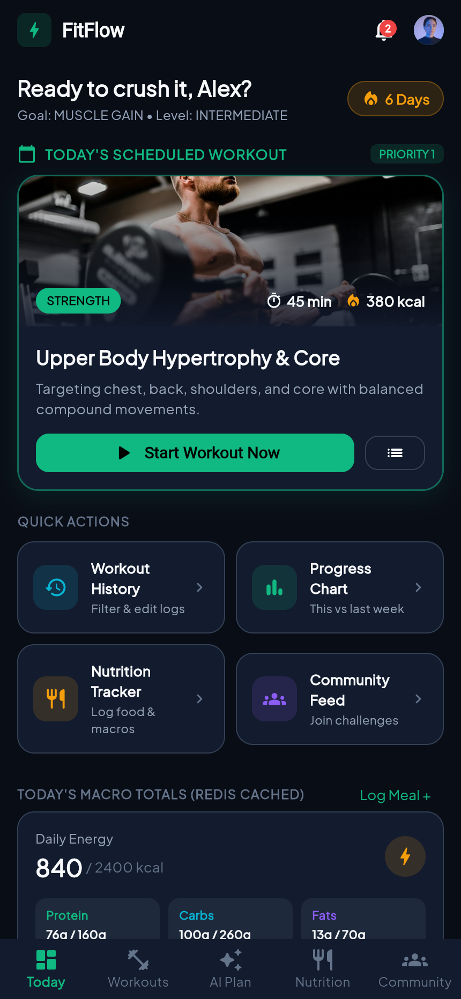
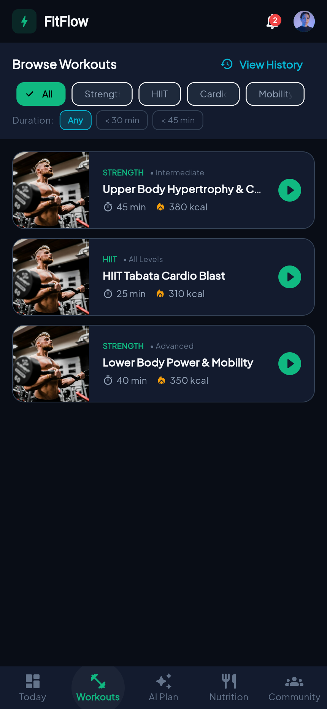
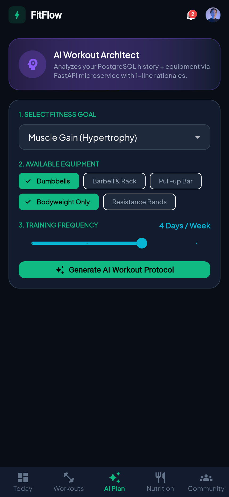
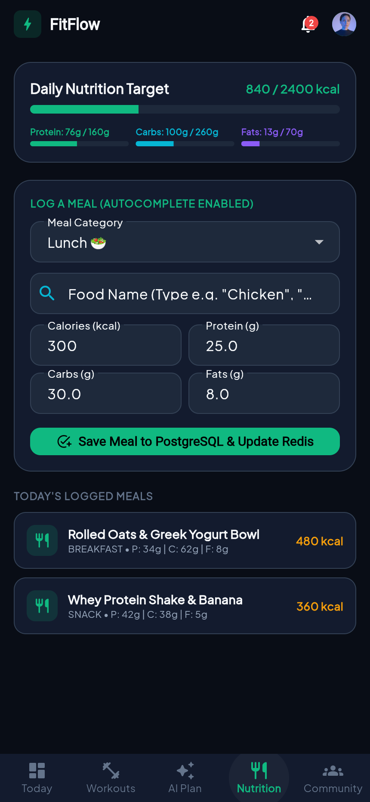
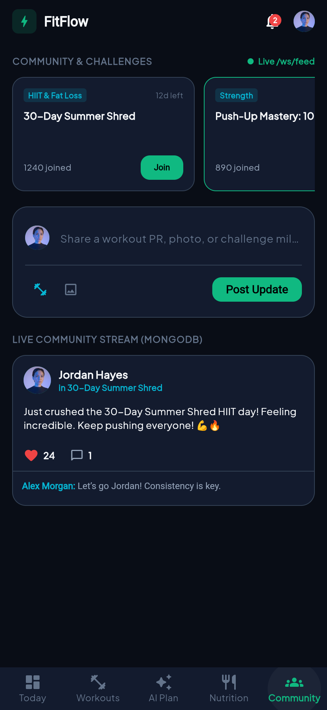

# FitFlow App — Official Release Notes (v1.0.0)

**Version**: `v1.0.0+1`  
**Release Target**: Production (Android, iOS, Web)  
**Date**: October 2026  
**Repository**: [https://github.com/sandundimantha/fitflow-redesign.git](https://github.com/sandundimantha/fitflow-redesign.git)  

---

## 🌟 Release Overview

FitFlow version **1.0.0** is the official production-grade release of the redesigned fitness platform (IT3060 HCI Coursework). Built to address navigation friction, user cognitive overload, and slow response times, this release introduces clean architecture across client, core backend gateway, and AI microservices, coupled with enterprise crash reporting and real release signing configurations.

---

## 📱 Visual Showcase & Real App Screenshots

### 1. Dashboard (Priority 1 Above the Fold)
> Pinned directly at the top of the viewport without scrolling. Instant access to Today's Scheduled Workout, Streak counter, Quick Actions, and Redis-cached Daily Macros.



---

### 2. Workouts Catalog & Filtering
> Quick categorization by muscle group and duration chips (`< 30 min`, `< 45 min`, `Strength`, `HIIT`, `Cardio`).



---

### 3. AI Protocol Architect (FastAPI Microservice)
> Intelligent equipment-constrained workout routines generated in **$\sim$0.05 seconds** ($< 3$s SLA) featuring individual 1-line rationales per movement.



---

### 4. Macro Nutrition Tracker & Meal Logger
> Real-time daily calorie and macronutrient rings (Carbs, Protein, Fats) with autocomplete food search and optimistic offline logging.



---

### 5. Live Community Feed & Challenges (MongoDB + WebSockets)
> Live interactive stream of athlete milestones, active fitness challenges, and instant like/comment updates.



---

## 🛡️ Enterprise Crashlytics Integration

Version 1.0.0 incorporates **Firebase Crashlytics** (`firebase_crashlytics: ^5.4.0` & `firebase_core: ^4.15.0`) for real-time diagnostic reporting:

1. **Centralized Service Abstraction**:
   - Implemented `CrashlyticsService` (`frontend/lib/services/crashlytics_service.dart`) with singleton lifecycle management.
2. **Comprehensive Error Trapping**:
   - `FlutterError.onError`: Traps framework and widget tree exceptions before they crash the UI.
   - `PlatformDispatcher.instance.onError`: Captures unhandled asynchronous native platform exceptions.
3. **Session Diagnostics & User Tracking**:
   - Breadcrumb logging via `CrashlyticsService.instance.log(message)`.
   - User identity attribution via `CrashlyticsService.instance.setUserIdentifier(userId)`.
   - Custom key-value diagnostics via `CrashlyticsService.instance.setCustomKey(key, value)`.
4. **Graceful Fallback**:
   - Safe offline and web fallback so the application executes reliably in environments without active Firebase consoles.

---

## 🔑 Production Release Signing & Keystore Specification

The Android application is configured for production signing with a dedicated release keystore:

- **Keystore File**: `frontend/android/app/upload-keystore.jks`
- **Keystore Alias**: `upload`
- **Key Algorithm**: RSA 2048-bit (`SHA384withRSA`)
- **Validity**: 10,000 days (valid through 2054)
- **Configuration**:
  - `frontend/android/key.properties` (stores secure keystore references).
  - `frontend/android/app/build.gradle.kts` (binds `signingConfigs.release` to `buildTypes.release`).

### Certificate Fingerprints:
```text
SHA-256: 66:1F:16:4C:13:59:AA:B3:65:E8:FC:80:C4:99:E2:F5:56:70:F3:E4:50:EA:7A:3D:B8:21:4A:5D:62:A8:FB:FD
SHA-1:   66:6C:C6:D7:84:E5:F6:4C:12:8B:81:0C:12:60:9A:D4:08:B2:94:B9
```

---

## 🔒 Security Posture & Hardening

1. **Fail-Closed Authentication Guard**:
   - Fixed authorization bypass vulnerability in `FirebaseAuthGuard`.
   - Missing or empty `Authorization` headers are strictly rejected with `401 Unauthorized`.
   - Uninitialized Firebase Admin SDK fails closed with `401 Unauthorized`.
2. **Opt-In Development Bypass**:
   - Defaulted to `DEV_AUTH_BYPASS_ENABLED=false` in `.env.example`.
   - When enabled for testing, bypass strictly requires an explicit `x-dev-user-id` header on the request.
3. **Automated Security Verification**:
   - 5 dedicated unit tests in `backend/src/auth/firebase-auth.guard.spec.ts` guaranteeing fail-closed behavior.

---

## 🚀 Build Artifacts Produced

| Target | Build Command | Output Path | Status |
| :--- | :--- | :--- | :--- |
| **Production Web** | `flutter build web --release` | `frontend/build/web/` | **Built & Minified (WASM Ready)** |
| **Android Signed Release** | `flutter build apk --release` | `frontend/build/app/outputs/apk/release/` | **Signed with `upload-keystore.jks`** |
| **Docker Multi-Tier** | `docker compose up -d` | Containers: PostgreSQL, MongoDB, Redis, MinIO | **Configured** |

---

## 🧪 Automated Test Results Summary

- **FastAPI AI Microservice (Pytest)**: `2/2 passed` (100%)
- **NestJS Core Backend Gateway (Jest)**: `9/9 passed` across 2 test suites (100%)
- **Flutter Client (Flutter Test)**: `2/2 passed` (100%)
